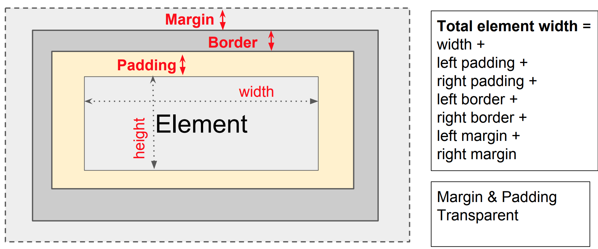

# More HTML and Introduction to CSS

## Introduction to CSS
Right now, our HTML looks a little plain. It is simply styled by the defaults from the user's browser. This is where **CSS (Cascading Style Sheets)** come in.

There are different ways to add CSS to your HTML:
- Inline
   ```html
   <h1 style="color:red;">Red heading</h1>
   ```
- Not inline, but still within the HTML
   ```html
   <style>
     h1 {
       color: red;
     }
   <\style>
   ```
- Link to an external style sheet
   ```html
   <link rel="stylesheet" type="text/css" href="main.css" />
   ```
   
   Then, in a separate file called *main.css*:
   ```css
     h1 {
       color: red;
     }
   ```
   
As you can see, you style an element by referring to its tag (like `h1`), followed by curly braces. Inside, you specify rules, such as `color: red;`.


## Selectors TODO
id
class

## Divs in HTML
Use the `<div></div>` tag to create imaginary "boxes" around your content. These boxes will come to be extremely useful for styling your elements.
```html
<div>
    <h1>Hi, I'm in a heading in a div</h1>
</div>
```

## Box Model TODO
